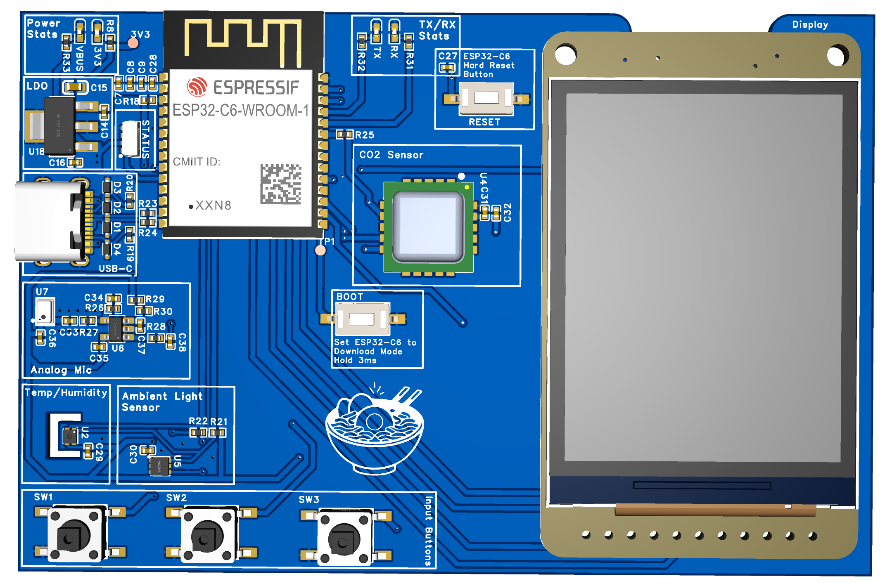
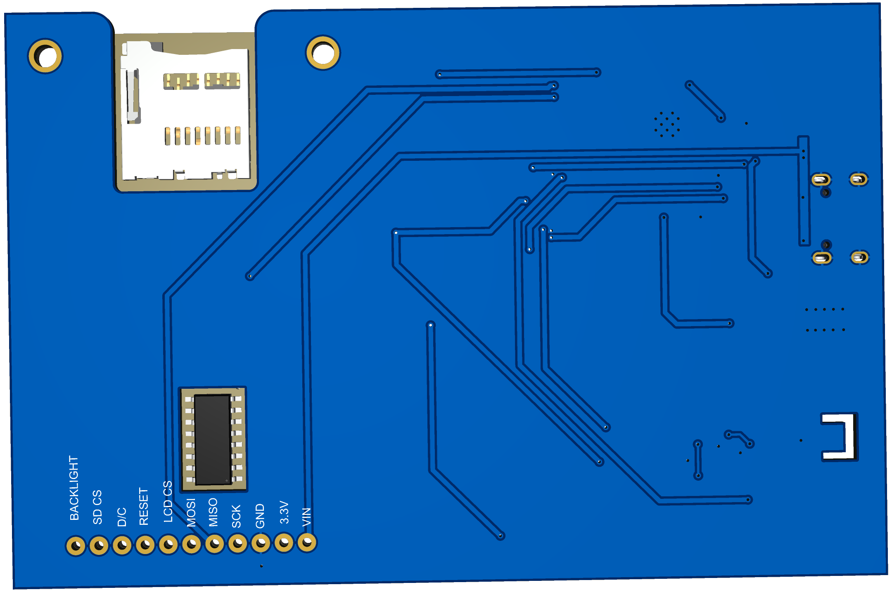
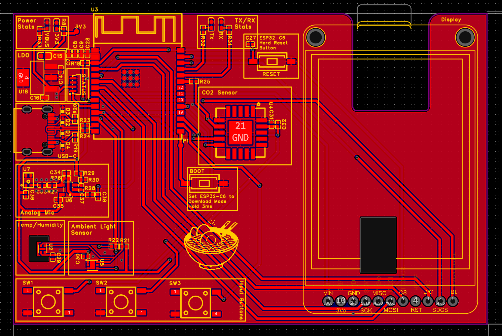
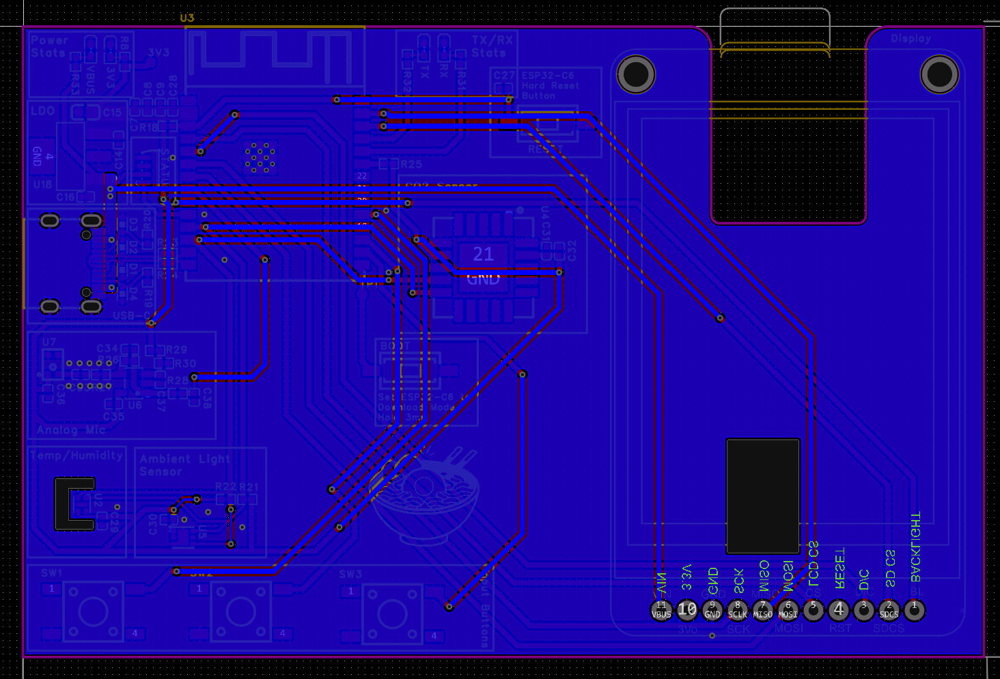

# RoomIQ — Indoor Environmental Quality Monitor

> A compact, self-contained mixed-signal PCB that simultaneously monitors five indoor environmental parameters and evaluates them against ASHRAE 55-2023 and the WELL Building Standard v2.

**Platform:** ESP32-C6 (RISC-V, Wi-Fi 6, BLE 5.3) &nbsp;|&nbsp; **Board:** 2-layer, 96.5 × 63.5 mm &nbsp;|&nbsp; **EDA:** EasyEDA &nbsp;|&nbsp; **Fab:** JLCPCB

---

## Table of Contents

- [Overview](#overview)
- [3D Renders](#3d-renders)
- [PCB Layout](#pcb-layout)
- [Sensor Suite](#sensor-suite)
- [Hardware Architecture](#hardware-architecture)
  - [MCU — ESP32-C6-WROOM-1-N8](#mcu--esp32-c6-wroom-1-n8)
  - [Digital Sensors — Shared I²C Bus](#digital-sensors--shared-ic-bus)
  - [Analog Microphone Signal Chain](#analog-microphone-signal-chain)
  - [Output Peripherals](#output-peripherals)
  - [Power System](#power-system)
- [Schematic](#schematic)
- [GPIO Map](#gpio-map)
- [Bill of Materials](#bill-of-materials)
- [Firmware Architecture](#firmware-architecture)
  - [State Machine](#state-machine)
  - [Sensor Polling Loop](#sensor-polling-loop)
  - [Threshold Logic](#threshold-logic)
- [IC Compatibility Analysis](#ic-compatibility-analysis)
- [Known Limitations & Future Work](#known-limitations--future-work)
- [Repository Structure](#repository-structure)

---

## Overview

Most consumer indoor monitors address a single metric (CO₂ or temperature alone). RoomIQ fuses **five sensor channels** into one device and evaluates readings against two tiers of thresholds:

1. **User-configurable limits** — set via a Wi-Fi captive portal and stored in NVS flash
2. **Published standards** — ASHRAE 55-2023 (thermal comfort) and WELL Building Standard v2 (ventilation, light, acoustics)

This lets the system distinguish *occupant discomfort* (amber) from *unsafe conditions* (red alert) without false alarms.

**Motivated by three well-documented indoor air quality problems:**

| Problem | Evidence |
|---------|----------|
| **CO₂ & cognition** | ASHRAE research links CO₂ > 1,000 ppm to measurable drops in decision-making. Most occupied rooms breach this within 1–2 hours without ventilation. |
| **Thermal comfort** | ASHRAE 55-2023 defines comfort in terms of *both* temperature and relative humidity. Single-axis thermostats ignore RH, causing discomfort at nominally correct temperatures. |
| **Silent stressors** | Ambient light and background noise are rarely monitored, despite strong links to eye strain, sleep disruption, and elevated cortisol. |

---

## 3D Renders

### Front — Component Side



> **Zones (left → right):** Power & LDO · ESP32-C6-WROOM-1 module · CO₂ sensor · 2.0" TFT display
> **Bottom row:** Analog mic front-end · Temp/Humidity (SHT41) · Ambient light (OPT3001) · Three user buttons

### Back — Routing Side



> Clean bottom layer with GND copper pour acting as an analog shield. TFT display connector header exposed along the bottom edge.

---

## PCB Layout

### Top Layer



> Red = signal traces on top copper. Yellow = silkscreen / component outlines. All functional zones labeled. GND thermal vias visible under the LDO pad.

### Bottom Layer



> Blue = GND copper pour on bottom. Red = signal vias and through-hole pads. The solid GND plane acts as an RF and analog shield across the full board.

### Zone Partitioning

```
┌─────────────────────────────────────────────────────────────────────┐
│  [Power]   [ESP32-C6-WROOM-1]   [CO₂ SCD40]         [TFT Display] │
│  USB-C                                                  320×240 IPS │
│  ESD diode  ←──── I²C bus (IO10/IO11) ────→                        │
│  AP7361C                                                            │
│                                                                     │
│  [Analog Mic Zone]   [SHT41]  [OPT3001]              [Display hdr] │
│  S15OT421            Temp/RH  Ambient                               │
│  MCP6001                      Light                                 │
│  GND star-tied                                                      │
│                                                                     │
│  [BTN_A]  [BTN_B]  [BTN_C]             [WS2812B]                   │
└─────────────────────────────────────────────────────────────────────┘
```

### Critical Routing Rules

| Rule | Detail |
|------|--------|
| Analog traces | Top Cu only; bottom GND pour acts as shield; zero digital crossings in analog zone |
| SPI bus | SCK/MOSI/MISO length-matched ±5 mm; 100 Ω series on SCK if trace > 10 cm |
| I²C bus | Short stubs to each sensor; pull-ups at midpoint; total length < 10 cm |
| Decoupling caps | ≤ 2 mm from supply pin; via at pad directly to GND plane |
| SCD40 | No Cu pour under bottom pads except required DNC pads (Sensirion DS §4.2) |
| OPT3001 | No SMD parts within 2× component height of optical aperture (TI DS §8.5) |
| ESP32 antenna | 3 mm Cu keep-out on all layers under WROOM antenna region |
| SHT41 placement | > 1 cm from SCD40/LDO to minimize thermal coupling during CO₂ measurement peaks |

Full layer drawings: [`hardware/Drawings.pdf`](hardware/Drawings.pdf)

---

## Sensor Suite

| Parameter | Sensor | Accuracy / Range | Reference Standard |
|-----------|--------|------------------|--------------------|
| Temperature & Humidity | Sensirion SHT41 | ±0.2 °C / ±1.8 % RH | ASHRAE 55-2023 |
| CO₂ Concentration | Sensirion SCD40 | ±50 ppm + 5 % (400–2000 ppm) | WELL v2 < 800 ppm |
| Ambient Light | TI OPT3001 | 0.01 – 83,865 lux, 23-bit dynamic range | WELL v2 ≥ 300 lux (task) |
| Acoustic Noise | S15OT421 + MCP6001 | 59 dB SNR, 130 dBSPL AOP | WELL v2 < 35 dBA |

---

## Hardware Architecture

### MCU — ESP32-C6-WROOM-1-N8

| Parameter | Requirement | Specified Value |
|-----------|-------------|-----------------|
| CPU | ≥ 120 MHz | 160 MHz RISC-V HP core |
| Flash | ≥ 4 MB | 8 MB in-package (FH8) |
| SRAM | ≥ 256 KB | 512 KB HP + 16 KB LP |
| ADC | ≥ 10-bit, ≥ 1 ch | 12-bit SAR, 7 ch (ADC1) |
| Radio | Wi-Fi + BLE | Wi-Fi 6 (802.11ax) + BLE 5.3 |
| Supply | 3.0–3.6 V | 3.0–3.6 V (VDDPST1/2) |
| GPIO | ≥ 16 pins | 30 GPIO (QFN40 WROOM module) |
| Deep-sleep | < 10 µA | 5 µA (Deep sleep with RTC timer) |

---

### Digital Sensors — Shared I²C Bus

**Bus:** IO10 (SDA) / IO11 (SCL) · 4.7 kΩ pull-ups to 3.3 V · 100 kHz (limited by SCD40)

> **Pull-up sizing note:** At 100 pF estimated bus capacitance, 4.7 kΩ gives t_r ≈ 376 ns — within the 1,250 ns Fast-Mode limit. SHT41 and OPT3001 support 400 kHz Fast Mode and are unaffected by the 100 kHz cap imposed by the SCD40.

| Device | I²C Address | Key Spec | Supply / Current | Why Selected |
|--------|-------------|----------|------------------|--------------|
| SHT41-AD1B-R2 | 0x44 | ±0.2 °C, ±1.8 % RH | 1.8–3.6 V / 900 µA pk | Factory-calibrated, DFN-4, ASHRAE-grade accuracy |
| SCD40-D-R2 | 0x62 | ±50 ppm +5 % (NDIR) | 2.4–5.5 V / 175 mA pk, 15 mA avg | Smallest SMD CO₂; photoacoustic; VDD+VDDH tied on PCB |
| OPT3001DNPRQ1 | 0x45 (ADDR→VDD) | 0.01–83 k lux, 23-bit | 1.6–3.6 V / 1.8 µA | Human-eye spectral match, >99 % IR rejection, USON-6 |

---

### Analog Microphone Signal Chain

The chain converts acoustic pressure at the MEMS capsule into a 12-bit digital value centered in the ADC's linear range:

```
[S15OT421-017 mic]  →  [HPF: 10µF + 1kΩ, fc≈16 Hz]  →  [MCP6001 inverting amp, Av=100×]
        →  [AAF: 390Ω + 100nF, fc≈4.08 kHz]  →  [ADC1_CH0, ATTEN2, 0–1.9 V]
```

| Stage | Component | Function | Key Values |
|-------|-----------|----------|------------|
| ① Mic | S15OT421-017 | Acoustic → analog | −42 dBV/Pa sensitivity; 59 dB SNR; 3.3 V supply |
| ② HPF | C=10 µF, R=1 kΩ | AC coupling, blocks DC mic bias | f_c = 1/(2π×1k×10µ) ≈ 16 Hz |
| ③ Amp | MCP6001, inverting | Signal gain | \|Av\| = 100k/1k = 100× (+40 dB); V+ biased at 1.65 V; Cf=100 pF → LPF f_c ≈ 15.9 kHz |
| ④ AAF | R=390 Ω, C=100 nF | Anti-alias low-pass filter | f_c ≈ 4.08 kHz; isolates op-amp Z_out from ADC C_in |
| ⑤ ADC | ADC1_CH0 (IO0) | 12-bit conversion | ATTEN2 range 0–1.9 V; signal swings ≈ 1.55–1.75 V at 60 dBSPL |

**ADC input range check:** MCP6001 DC output = 1.65 V (VDD/2). With Av = 100× and mic sensitivity −42 dBV/Pa, a 60 dBSPL signal → V_rms ≈ 16 mV after gain → ADC swing ≈ 1.55–1.75 V, centered within ATTEN2. Firmware flags near-rail ADC samples to detect clipping during loud events.

---

### Output Peripherals

#### TFT Display — Adafruit #4311 (ST7789)
- **Resolution:** 2.0" IPS, 320 × 240, 16-bit colour
- **Interface:** 4-wire SPI up to 80 MHz; write-only (MISO N/C)
- **Supply:** 3.3–5 V via breakout's onboard LDO; CD74HC4050 level-shifts 3.3 → 5 V signals
- **Backlight:** PWM via IO1 (LEDC peripheral); auto-dims using OPT3001 lux reading (closed-loop)
- **Init:** `tft.init(240, 320); rotation = 90` (landscape)

#### WS2812B-4020 RGB Status LED
- **Protocol:** Single-wire NRZ 800 kbps via ESP32-C6 RMT peripheral on IO8
- **Supply:** 5 V VBUS direct — bypasses LDO to reduce thermal load
- **Level shift:** BSS138 N-MOSFET (IO8 → 5 V) required — WS2812B V_IH = 3.5 V min; ESP32-C6 V_OH ≈ 3.0–3.1 V at light load (insufficient without level-shifter)
- **Brightness:** ≤ 10 % duty → ~6 mA draw; 300 Ω series resistor for overshoot suppression
- **Reset:** 280 µs low; handled by RMT frame gap

---

### Power System

```
USB-C 5V VBUS
    │
    ├─→ RLSD52A051UC ESD (CC1, CC2, D+, D−)
    │       CC: 5.1 kΩ → GND  (5V / 0.9A sink advertisement)
    │       D+/D−: 27 Ω series termination resistors
    │
    ├─→ WS2812B-4020 (direct VBUS, ~6 mA)
    │
    └─→ AP7361C-33E LDO (SOT-223)
            Output: 3.3 V ±1 %, up to 800 mA
            Dropout: ~1.2 V @ 800 mA; 1.7 V headroom from 5 V
            Decoupling: 2×10µF ∥ 1µF ∥ 100nF on each VDD pin
            │
            └─→ ESP32 + SHT41 + SCD40 + OPT3001 + mic + MCP6001 + TFT backlight
```

**Thermal budget:**

| Load | Power Dissipated | ΔT_J | Status |
|------|-----------------|------|--------|
| Average (~200 mA) | 1.7 V × 0.2 A = 0.34 W | ≈ 37 °C | ✅ Safe (T_J max = 125 °C) |
| Peak (~495 mA, Wi-Fi TX + SCD40 + TFT) | 0.84 W | ≈ 92 °C | ⚠️ Copper heat-spreader pad required |

---

## Schematic

Full schematic: [`hardware/Schematic.pdf`](hardware/Schematic.pdf)

**Major sub-circuits:**
- **ESP32-C6-WROOM-1-N8** — center; decoupling caps on every VDD/GND pair; RESET (EN) with 5.1 kΩ pull-up + 100 nF; BOOT strapping via IO9
- **USB-C** — GCT USB4135 mid-mount receptacle; RLSD52A051UC ESD on all 4 data lines; 5.1 kΩ CC resistors; 27 Ω D+/D− stubs
- **3.3 V LDO** — AP7361C-33E in SOT-223; bulk caps on input and output
- **MEMS mic & analog front-end** — see signal chain above
- **I²C sensor cluster** — SHT41, SCD40 (VDD+VDDH tied), OPT3001; 4.7 kΩ pull-ups at midpoint of bus
- **TFT display header** — SPI2 signals routed to right-edge connector; CD74HC4050 level-shifting on the breakout
- **WS2812B** — IO8 → BSS138 N-MOSFET level-shifter → 300 Ω → LED DIN; status indicator resistors
- **User buttons** — EN (reset), BOOT (IO9), BTN_A (IO18), BTN_B (IO19), BTN_C (IO21); 10 kΩ pull-up + 100 nF RC debounce (τ = 1 ms) each

---

## GPIO Map

| IO | Net | Dir | Interface | Notes |
|----|-----|-----|-----------|-------|
| IO0 | MIC_ANALOG | IN | ADC1_CH0 | MCP6001 output → AAF (390 Ω + 100 nF) → ADC; ATTEN2 (0–1.9 V) |
| IO1 | TFT_BL | OUT | LEDC PWM | Backlight brightness; closed-loop dim via OPT3001 lux |
| IO2 | MISO | IN | SPI2 | SD card only — TFT is write-only (MISO N/C at ST7789) |
| IO3 | SD_CS | OUT | SPI2 | SD card chip-select (active low) |
| IO4 | TFT_CS | OUT | SPI2 | TFT chip-select (active low) |
| IO5 | TFT_DC | OUT | GPIO | ST7789 data / command select |
| IO6 | SCK | OUT | SPI2 | Shared: TFT (≤ 80 MHz) and SD card (≤ 40 MHz) |
| IO7 | MOSI | OUT | SPI2 | Shared SPI data-out for TFT and SD card |
| IO8 | LED_DIN | OUT | RMT | WS2812B NRZ data; 300 Ω series; level-shifted to 5 V via BSS138 |
| IO10 | SDA | BIDIR | I²C | SHT41, SCD40, OPT3001; 4.7 kΩ pull-up to 3.3 V |
| IO11 | SCL | OUT | I²C | 100 kHz (SCD40 limit); single pull-up pair for all 3 devices |
| IO15 | JTAG_SEL | IN | Strapping | 10 kΩ pull-up → HIGH → USB-JTAG selected at boot |
| IO18 | BTN_A | IN | GPIO | Active-low; 10 kΩ pull-up + 100 nF RC debounce (τ = 1 ms) |
| IO19 | BTN_B | IN | GPIO | Active-low; 10 kΩ pull-up + 100 nF RC debounce |
| IO21 | BTN_C | IN | GPIO | Active-low; 10 kΩ pull-up + 100 nF RC debounce |
| IO9 | BOOT_BTN | IN | Strapping | Internal WPU at reset; tactile → GND for download mode |
| EN | RESET_BTN | IN | Enable | 5.1 kΩ pull-up + 100 nF; tactile → GND for hard reset |
| TX0/RX0 | UART0 | OUT/IN | UART0 | Debug header + USB-CDC via USB Serial/JTAG controller |

---

## Bill of Materials

| Component | Part # / Source | Qty | Unit $ | Notes |
|-----------|----------------|-----|--------|-------|
| ESP32-C6-WROOM-1-N8 | Espressif via Mouser | 1 | $4.20 | MCU module, 8 MB flash |
| SHT41-AD1B-R2 | 1649-SHT41-AD1B-R2CT-ND | 1 | $4.50 | Temp + humidity, I²C |
| SCD40-D-R2 | 1649-SCD40-D-R2CT-ND | 1 | $14.90 | CO₂ NDIR, I²C |
| OPT3001DNPRQ1 | 296-OPT3001DNPRQ1CT-ND | 1 | $2.30 | Ambient light, USON-6 |
| S15OT421-017 | LCSC / Goermicro | 1 | $0.75 | MEMS analog mic, bottom port |
| MCP6001T-I/OT | MCP6001T-I/OTCT-ND | 1 | $0.54 | Op-amp, SOT-23-5 |
| AP7361C-33E | AP7361C-33E-13DICT-ND | 1 | $0.48 | 3.3 V LDO, SOT-223 |
| WS2812B-4020 | Adafruit / LCSC | 1 | $0.35 | RGB status LED, side-emitting |
| BSS138 N-MOSFET | Digi-Key tape | 1 | $0.10 | Level-shifts IO8 to 5 V for WS2812B |
| Adafruit 2.0" TFT #4311 | Adafruit #4311 | 1 | $14.95 | ST7789 + SD slot, includes level shifter |
| RLSD52A051UC | Bourns / Digi-Key | 1 | $0.48 | USB-C ESD — CC + D+/D− protection |
| USB-C receptacle 16-pin | GCT USB4135 / Digi-Key | 1 | $1.20 | SMD, mid-mount |
| Res 5.1 kΩ 0402 | Generic tape | 2 | $0.05 | USB CC pull-downs |
| Res 4.7 kΩ 0402 | Generic tape | 2 | $0.05 | I²C SDA + SCL pull-ups |
| Res 10 kΩ 0402 | Generic tape | 9 | $0.05 | Button pull-ups, bias divider, IO15, BSS138 pull-up |
| Res 100 kΩ 0402 | Generic tape | 3 | $0.05 | Mic Rf + bias divider (×2) |
| Res 1 kΩ 0402 | Generic tape | 1 | $0.05 | Mic input Rin |
| Res 390 Ω 0402 | Generic tape | 1 | $0.05 | AAF series resistor |
| Res 27 Ω 0402 | Generic tape | 2 | $0.05 | USB D+ / D− series termination |
| Cap 10 µF 0402 X5R | Generic tape | 5 | $0.10 | LDO in/out + mic AC coupling |
| Cap 1 µF 0402 | Generic tape | 2 | $0.08 | ESP32 VDD decoupling |
| Cap 100 nF 0402 | Generic tape | 10 | $0.05 | Bypass caps + RC debounce + AAF |
| Cap 100 pF 0402 | Generic tape | 1 | $0.05 | Op-amp feedback Cf |
| Tactile switch 6 mm SMD | SW1020CT-ND | 5 | $0.30 | EN, BOOT, BTN A/B/C |
| PCB, 2-layer | JLCPCB (custom Gerber) | 1 | $8.00 | 96.5 × 63.5 mm |

**Estimated single-unit BOM cost: ~$58–65 USD**
Dominant costs: SCD40 ($14.90) + TFT display ($14.95). Volume pricing reduces both significantly.

Full spreadsheet: [`hardware/BOM.xlsx`](hardware/BOM.xlsx)

---

## Firmware Architecture

### State Machine

```
                    Power-On / EN Reset
                           │
                           ▼
                    ┌─────────────┐
                    │    BOOT     │  Init GPIO, SPI, I²C, RMT, LEDC
                    │             │  Clear display, mount SD, read NVS
                    └──────┬──────┘
                   NVS     │      NVS
                  valid    │      empty
                    │      │        │
                    │      │        ▼
                    │      │  ┌─────────────┐
                    │      │  │   CONFIG    │  Start softAP → captive portal
                    │      │  │             │  Collect Wi-Fi creds + thresholds
                    │      │  │             │  Write NVS on form submit
                    │      │  └──────┬──────┘
                    │      │  Form   │
                    │   submitted    │
                    └──────┴────┐   │
                                ▼   ▼
                         ┌─────────────┐  BTN_A ┌─────────────┐
                         │    SENSE    │────────►│   DISPLAY   │
                         │             │         │             │
                         │ Poll every  │◄────────│ 3 views:    │
                         │ 5 s         │  30 s   │ summary /   │
                         │ SD+Wi-Fi    │  idle   │ detail+trend│
                         │ every 60 s  │         │ /30-min hist│
                         └──────┬──────┘         └──────┬──────┘
                    CO₂ alert   │                        │ BTN_B
                    stays awake │                        ▼
                    BTN_C →     │                 ┌─────────────┐
                    CONFIG      │                 │    SLEEP    │
                                │◄────────────────│             │
                                │  BTN_A / CO₂   │ Display off │
                                │  > limit        │ 60 s rate   │
                                                  │ Light-sleep │
                                                  └─────────────┘
```

**Fault handling:** Invalid NVS → CONFIG. Wi-Fi fail → continue local logging to SD. SD fail → display + Wi-Fi dashboard remain active. I²C device NAK → mark value invalid, show error on display, continue with remaining sensors.

### Sensor Polling Loop

Non-blocking, time-sliced architecture:

- **Every 5 s:** Poll I²C sensors, retrieve DMA audio buffer, apply digital A-weighting, evaluate thresholds, update TFT + WS2812B immediately
- **Every 60 s:** Average the 12 buffered readings, append to SD CSV, push JSON over Wi-Fi — decoupled from the fast loop to protect the LDO thermal budget and minimize SD flash wear

```c
void state_machine_sense() {
    unsigned long now = millis();

    if (now - last_sample_ms >= 5000) {
        last_sample_ms = now;
        SensorData rd = {NAN, NAN, NAN, NAN, NAN};

        // Digital sensors
        if (!SHT41.measure(&rd.temp_C, &rd.humidity)) log_error("SHT41 err");
        if (SCD40.isDataReady()) rd.co2_ppm = SCD40.readMeasurement();
        rd.lux = OPT3001.readResult();
        OPT3001.startMeasurement();  // trigger next async conversion

        // Analog audio — DMA buffer + digital A-weighting
        int16_t* audio = I2S_get_latest_dma_buffer();
        apply_a_weighting(audio, 1024);
        rd.spl_dBA = 20.0 * log10(calculate_rms(audio, 1024) / V_REF) + CAL_OFFSET;

        // Evaluate + update local UI
        uint8_t flags = evaluate_thresholds(rd, user_thresholds);
        update_display(rd, flags);
        update_ws2812b(flags);
        if (flags & ALERT_CO2_CRIT) trigger_alarm();
        data_buf.push(rd);

        // Decoupled logging (every 60 s)
        if (now - last_publish_ms >= 60000) {
            last_publish_ms = now;
            SensorData avg = data_buf.get_average();
            log_sd_csv(avg);
            push_wifi_json(avg);
            data_buf.clear();
        }
    }
}
```

### Threshold Logic

Three-tier evaluation — user limits → ASHRAE 55-2023 → WELL v2:

| Parameter | User (example) | ASHRAE 55-2023 | WELL v2 | Alert Action |
|-----------|---------------|----------------|---------|--------------|
| Temperature | 20–24 °C | 20–26 °C (operative) | 20–25 °C | Amber banner; yellow LED |
| Humidity | 40–60 % RH | 30–70 % RH | 30–60 % RH | Amber banner; yellow LED |
| CO₂ | < 1000 ppm | 1000 ppm (proxy) | < 800 ppm | Red LED; force wake from SLEEP; log event |
| Illuminance | 200–500 lux | N/A (informational) | ≥ 300 lux (task area) | Amber display highlight |
| Noise (SPL) | < 60 dBA | < 45 dBA (office) | < 35 dBA background | Yellow LED; log event |

---

## IC Compatibility Analysis

### Power Rails

| Component | Supply Range | Rail | Typ / Peak Draw | Result |
|-----------|-------------|------|-----------------|--------|
| ESP32-C6-WROOM | 3.0–3.6 V | 3.3 V | 80 mA idle / 240 mA TX | ✅ In-spec |
| SHT41 | 1.8–3.6 V | 3.3 V | 4 µA avg / 900 µA pk | ✅ In-spec |
| SCD40 | 2.4–5.5 V | 3.3 V | 15 mA avg / 175 mA pk | ✅ VDD+VDDH tied on PCB |
| OPT3001 | 1.6–3.6 V | 3.3 V | 1.8 µA active / 0.3 µA sleep | ✅ In-spec |
| S15OT421 mic | 2.0–3.6 V | 3.3 V | 150 µA | ✅ In-spec |
| MCP6001 | 1.8–6.0 V | 3.3 V | 100 µA typ | ✅ In-spec |
| WS2812B-4020 | 3.7–5.3 V | 5 V VBUS | ~6 mA @ 10 % | ✅ Direct VBUS |
| TFT display | 3.3–5.0 V | 3.3 V | ~50 mA (backlight on) | ✅ Breakout has onboard LDO |
| AP7361C LDO | Vin 4.75–15 V | 5 V VBUS | Delivers ≤ 800 mA | ✅ 1.7 V headroom |

### Logic Levels

| Interface | Driver VOH min | Receiver VIH min | Result |
|-----------|---------------|------------------|--------|
| I²C SDA/SCL | ESP32-C6: 2.64 V (0.8×VDD) | SHT41/SCD40/OPT3001: 2.31 V | ✅ OPT3001 is 5.5 V-tolerant |
| SPI (TFT/SD) | ESP32-C6: 2.64 V | ST7789 via CD74HC4050 | ✅ Breakout level-shifts 3.3 → 5 V |
| WS2812B DIN | ESP32-C6 IO8: ~3.0 V typ | WS2812B: 3.5 V min | ✅ Resolved via BSS138 level-shifter |
| ADC input IO0 | MCP6001 out: 1.65 V bias | ADC1_CH0 ATTEN2: 0–1.9 V | ✅ Signal ±0.1 V → 1.55–1.75 V |
| USB D+/D− | USB host: 3.3 V FS | ESP32-C6 USB PHY | ✅ 27 Ω series resistors added |

---

## Known Limitations & Future Work

| Limitation | Detail | Future Fix |
|------------|--------|------------|
| Approximate SPL | Software A-weighting only; no dedicated A-weighting hardware | Dedicated A-weighting IC or sharper analog filter |
| ADC clipping | Av = 100× optimized for quiet–moderate indoor SPL; loud events may clip | Reduce analog gain or use wider ADC attenuation range |
| CO₂ drift | SCD40 requires periodic recalibration for long-term accuracy | Automatic self-calibration (ASC) mode + forced recal routine |
| No pressure compensation | SCD40 altitude compensation requires barometric pressure input | Add BMP388 or similar on I²C |
| Single-pole AAF | f_c ≈ 4.08 kHz, −20 dB/decade rolloff | Multi-pole Butterworth AAF for cleaner Nyquist rejection |

**Privacy note:** Raw audio is never buffered beyond the RMS computation window and is never transmitted over Wi-Fi.

---

## Repository Structure

```
RoomIQ/
├── README.md
├── .gitignore
├── images/
│   ├── 3D_Render_Front.png     ← 3D render, component side
│   ├── 3D_Render_Back.png      ← 3D render, routing side
│   ├── PCB_Top_Layer.png       ← Top copper + silkscreen
│   └── PCB_Bottom_Layer.png    ← Bottom GND pour
└── hardware/
    ├── Schematic.pdf           ← Full EasyEDA schematic
    ├── Drawings.pdf            ← PCB layer drawings
    ├── Gerber.zip              ← JLCPCB-ready fabrication files
    └── BOM.xlsx                ← Bill of materials
```

### Component Datasheets

| Component | Datasheet |
|-----------|-----------|
| ESP32-C6-WROOM-1 | [Espressif DS v1.5](https://www.espressif.com/sites/default/files/documentation/esp32-c6_datasheet_en.pdf) |
| Sensirion SCD40 | [Sensirion DS v1.3](https://sensirion.com/media/documents/48C4B7FB/64C134E7/Sensirion_SCD4x_Datasheet.pdf) |
| Sensirion SHT41 | [Sensirion DS](https://sensirion.com/media/documents/33C09C07/622B9FC5/Datasheet_SHT4x.pdf) |
| TI OPT3001 | [TI SBOS853C](https://www.ti.com/lit/ds/symlink/opt3001.pdf) |
| Microchip MCP6001 | [DS20001733L](https://ww1.microchip.com/downloads/en/DeviceDoc/MCP6001-1R-1U-2-4-1-MHz-Low-Power-Op-Amp-DS20001733L.pdf) |
| Goermicro S15OT421 | [Spec v3.0](https://www.goermicro.com) |
| WorldSemi WS2812B-4020 | [DS v1.2](https://cdn-shop.adafruit.com/product-files/4684/4684_WS2812B-4020.pdf) |
| Diodes Inc AP7361C | [Datasheet](https://www.diodes.com/assets/Datasheets/AP7361C.pdf) |

---

*Designed in EasyEDA · Fabricated at JLCPCB · ECE 4275: Microelectronic Systems*
